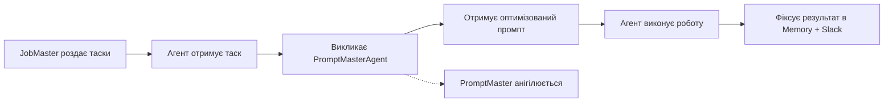

# AiUnit71 — Production Pipeline

> Повний цикл виконання клієнтського замовлення: від брифу до фінальної поставки.

---

## Фаза 0 — Ініціалізація проекту

**Кімната:** `NicheAdapterRoom` (автоматична)
**Агент:** `NicheAdapterAgent`

Клієнт звертається за послугою. Система автоматично:

1. Визначає нішу клієнта (косметика, fintech, crypto, e-commerce тощо)
2. Генерує `NicheProfile` — адаптований профіль ніші
3. Формує `ServicePackage` — перелік доступних послуг для цієї ніші
4. Визначає рівень автономності (`AutonomyLevel: 0–3`)
5. Створює Slack-канал проекту

**Вихід →** `NicheProfile`, `ServicePackage`, `AutonomyLevel`

---

## Фаза 1 — Briefing

**Кімната:** `BriefingRoom`
**Агент:** `BriefMasterAgent`

BriefMasterAgent отримує запит клієнта і:

1. Аналізує бріф у контексті `NicheProfile`
2. Деконструює вхідні дані та формалізує завдання
3. Визначає список потрібних Rooms та Agents (через `Planner`)
4. Формує промпт для BrainStorm-фази
5. Конвертує дані у внутрішній формат:
   - **Для людини** → Markdown (читабельний звіт)
   - **Для агентів** → JSON (структурований обмін)
6. Публікує результат у Slack-канал проекту

**Quality Gate:** CEO Людина має затвердити бріф перед переходом до Фази 2.

**Вихід →** `BriefReport`, список потрібних `Rooms`, список `Agents`

---

## Фаза 2 — BrainStorm

**Кімната:** `BrainstormRoom`
**Агент:** `BrainStormAgent` (модератор)

### Учасники (обов'язкові)

- `CEOAgent` + **CEO Людина**
- `TeamLeadAgent`
- `PromptMasterAgent`

### Учасники (за нішею)

Залежать від `NicheProfile`. Приклад для AI Video Pack:

- `VideoAgent`, `AnimationAgent`, `MusicAgent`, `CopywriterAgent`

Присутні завжди:

- `FinanceAgent`, `MarketingAgent`, `SMMAgent`, `CreativeAgent`

### Процес

```
┌─ CEO Людина ініціює брейншторм
│
├─ Агенти генерують ідеї паралельно
├─ Дебати, контр-аргументи, пропозиції
├─ CEO Людина втручається / коригує напрямок
│
├─ BrainStormAgent формує консолідований звіт
├─ TeamLeadAgent формує порядок дій
│
└─ Звіт зберігається в папку проекту + Slack
```

**Quality Gate:** CEO Людина затверджує напрямок.

**Вихід →** `BrainstormReport`, `ActionPlan`

---

## Фаза 2.5 — Оцінка вартості

**Кімната:** `CostRoutingRoom`
**Агент:** `CostRouterAgent`

На основі `BrainstormReport` та `ActionPlan`:

1. Оцінює токен-бюджет для кожного завдання
2. Маршрутизує операції: **Local (Ollama) → Cloud (OpenRouter) → Premium**
3. Формує кошторис проекту з деталізацією по кімнатах
4. Перевіряє баланс кредитів та лімітів

**Quality Gate:** Якщо кошторис перевищує поріг (`costThreshold`) — потрібне підтвердження CEO Людини.

**Вихід →** `CostEstimate`, `RoutingPlan`

---

## Фаза 3 — Роздача роботи

**Кімната:** `JobMasterRoom`
**Агент:** `JobMasterAgent`

JobMasterAgent отримує `BrainstormReport` + `CostEstimate` і:

1. Формує конкретні завдання (`Task`) для кожного агента
2. Визначає залежності між завданнями (`dependencies`)
3. Групує паралельні завдання (`parallelGroups`)
4. Для кожного завдання визначає:
   - Цільову кімнату (`assignedRoom`)
   - Пріоритет (`TaskPriority`)
   - Дедлайн
   - Критерії прийняття (`acceptanceCriteria`)
5. Фіксує роздані таски в Slack

**Вихід →** `TaskList[]`, `ExecutionPlan`

---

## Фаза 4 — Виконання роботи

**Кімнати:** Динамічні (залежно від `ExecutionPlan`)
**Агенти:** Відповідно до призначень з Фази 3

### Процес виконання



### Ключові правила

- **Паралельність:** Креативні кімнати працюють одночасно (Unbreakable Creative Continuity)
- **PromptMasterAgent** — ефемерний: створюється per-task, анігілюється після видачі промпту
- **Взаємодія:** Агенти можуть обмінюватися даними через `EventBus` та `MemoryStore`
- **HITL:** Агент може запросити допомогу людини через `HitlManager` в будь-який момент
- **Автономність:** Регулюється `AutonomyLevel` (0=ручний → 3=freeride)
- **Cost-aware:** Кожна LLM-операція проходить через `CostRouter`

### Моніторинг (паралельно)

Протягом Фази 4 працює `EvaluationAgent`:

- Формує критерії успіху на основі Брифу та BrainstormReport
- Оцінює проміжні результати в реальному часі
- Встановлює гандікап виконання
- Може ініціювати ранню зупинку при критичних відхиленнях

**Вихід →** `TaskResults[]`, `EvaluationMetrics`

---

## Фаза 5 — Контроль якості та Звітність

**Кімната:** `ReportMasterRoom`
**Агенти:** `ReportMasterAgent`, `EvaluationAgent`

### Процес

```
┌─ ReportMaster завантажує результати з усіх кімнат
│
├─ EvaluationAgent перевіряє відповідність критеріям успіху
│  ├─ ✅ Пройшло → формується звіт для клієнта
│  └─ ❌ Не пройшло → повернення на доопрацювання
│
├─ CEO Людина рев'юіть результат
│  ├─ ✅ Затверджено → перехід до Фази 6
│  └─ 🔄 Потрібні зміни → вибір кроків для реітерації
│     └─ Людина обирає: які кроки реітерувати, скільки разів
│
└─ Фіксація в Slack
```

### Реітерація

При поверненні на доопрацювання:

- `JobMasterAgent` переформовує лише невдалі завдання
- Зберігається контекст попередніх ітерацій в `MemoryStore`
- `CostRouter` перераховує бюджет для повторних операцій
- Максимальна кількість ітерацій обмежується конфігурацією

**Вихід →** `ClientReport`, `QualityScore`

---

## Фаза 6 — Фіналізація та Поставка

**Кімната:** `FinalizerRoom`
**Агент:** `FinalizerAgent`

FinalizerAgent формує фінальний пакет:

1. **Інтерактивний дашборд**
   - Статистика роботи (час, токени, вартість по кімнатах)
   - Таймлайн виконання
   - Метрики якості від EvaluationAgent

2. **Презентація для клієнта**
   - Огляд виконаної роботи
   - Ключові рішення з брейншторму
   - Before/After порівняння (якщо застосовно)

3. **Вихідні файли**
   - Завантаження на хмарне сховище
   - Організована структура папок
   - Метадані та ліцензії

4. **Архів проекту**
   - Повний лог роботи агентів (з `MemoryStore`)
   - Кошторис vs. фактичні витрати
   - Learned patterns → `LearningRoom` для майбутніх проектів

**Вихід →** `FinalDeliverable`, `ProjectArchive`, `LessonsLearned`

---

## Маппінг Pipeline → Codebase

| Фаза | Кімната в Pipeline | Статус в коді | Ключовий модуль |
|------|-------------------|--------------|-----------------|
| 0 | NicheAdapterRoom | ✅ `NicheAdapter` | `src/adapters/niche-adapter.ts` |
| 1 | BriefingRoom | ✅ `BriefingRoom` | `src/rooms/briefing-room.ts` |
| 2 | BrainstormRoom | ✅ `BrainstormRoom` | `src/rooms/brainstorm-room.ts` |
| 2.5 | CostRoutingRoom | ✅ `CostRoutingRoom` | `src/rooms/cost-routing-room.ts` |
| 3 | JobMasterRoom | ✅ `JobMasterRoom` | `src/rooms/jobmaster-room.ts` |
| 4 | * (динамічні) | ✅ 15 кімнат | `src/rooms/*.ts` |
| 4 | EvaluationRoom | ✅ `EvaluationRoom` | `src/rooms/evaluation-room.ts` |
| 5 | ReportMasterRoom | ✅ `ReportMasterRoom` | `src/rooms/reportmaster-room.ts` |
| 6 | FinalizerRoom | ✅ `FinalizerRoom` | `src/rooms/finalizer-room.ts` |

### Існуючі модулі, задіяні в Pipeline

- `Orchestrator` → центральна нервова система, керує всіма фазами
- `Planner` → декомпозиція завдань та маршрутизація по кімнатах
- `CostRouter` → cost-aware маршрутизація моделей
- `HitlManager` → Human-in-the-Loop контроль (4 рівні автономності)
- `MemoryStore` → зберігання контексту та досвіду між фазами
- `EventBus` → комунікація між кімнатами та агентами
- `LlmClient` → уніфікований інтерфейс до Ollama / Cloud API
- `LearningRoom` → засвоєння патернів з попередніх проектів
- `RecruiterRoom` → динамічне створення нових агентів/кімнат
